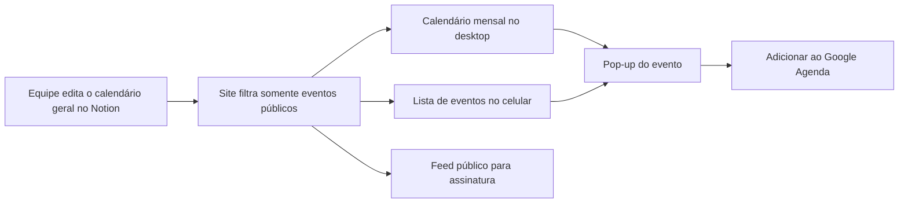
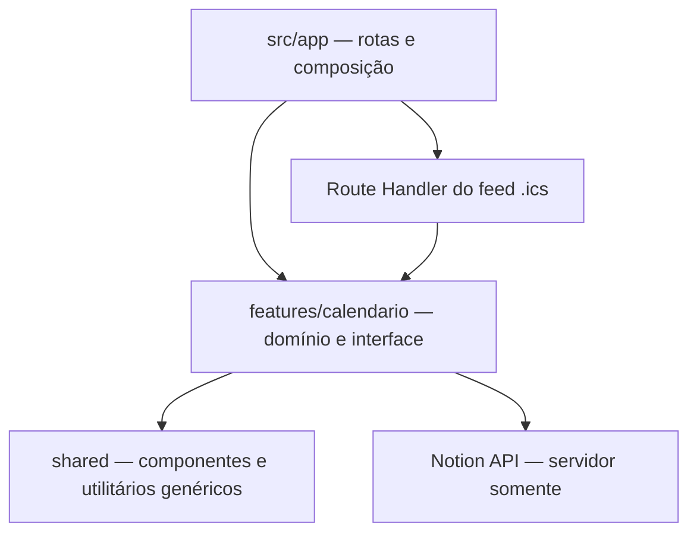

# Planejamento e desenvolvimento — Calendário Público GEAR V1

## Objetivo

Criar uma página pública de calendário no site do GEAR, alimentada pelo calendário geral do Notion.

A equipe continuará alterando os eventos somente no Notion. O site exibirá apenas aqueles marcados como públicos.

O público poderá:

- consultar os eventos;
- abrir os detalhes;
- adicionar um evento confirmado ao Google Agenda;
- assinar o calendário público do GEAR.

## Estado da implementação

Implementado no repositório:

- página responsiva, calendário mensal, lista móvel, legenda e pop-up acessível;
- tipos e normalização fail-closed;
- consulta server-only da Data Source do Notion, com filtro público, paginação, timeout e cache de cinco minutos;
- estados seguros para calendário vazio ou indisponibilidade externa, sem fallback demonstrativo;
- link individual para adicionar somente eventos confirmados ao Google Agenda;
- feed público `/calendario/feed.ics`, somente com eventos confirmados, UIDs estáveis e datas de dia inteiro com fim exclusivo;
- diálogo para copiar o endereço de assinatura e abrir o arquivo `.ics`;
- testes unitários e E2E da interface e das integrações.

Dependências externas ainda necessárias para ativar dados reais:

- criar ou conferir os seis campos na Data Source do Notion;
- criar a integração de leitura e compartilhar a Data Source com ela;
- cadastrar `NOTION_API_KEY` e `NOTION_CALENDAR_DATA_SOURCE_ID` na Vercel;
- validar em produção um evento público e um evento interno conhecido.

Até essa ativação, página e feed permanecem indisponíveis. O site não publica eventos fictícios e passa a usar somente a fonte real normalizada quando as duas variáveis do Notion forem cadastradas.

## Funcionamento geral



## Etapa 1 — Configurar o calendário no Notion

Será utilizado um calendário geral com eventos públicos e internos.

### Campos

| Campo       | Tipo                 | Obrigatório | Exemplo                          |
| ----------- | -------------------- | ----------: | -------------------------------- |
| Nome        | Título               |         Sim | Palestra de Robótica             |
| Período     | Data inicial e final |         Sim | 4 a 10 de janeiro                |
| Confirmação | Seleção              |         Sim | Confirmado / A definir           |
| Visibilidade | Seleção múltipla    |         Sim | Público / Interno                |
| Descrição   | Texto                |         Não | Apresentação aberta à comunidade |
| Link        | URL                  |         Não | Página de inscrição              |

### Significado dos campos

#### Visibilidade

- Somente Público selecionado: aparece no site.
- Interno: nunca aparece no site.
- Público e Interno simultaneamente: é descartado por segurança.

#### Confirmação

- **Confirmado:** a data já está definida.
- **A definir:** o evento acontecerá dentro daquele período, mas o dia exato ainda não está confirmado.

#### Período

- Confirmado com um dia: evento realizado naquele dia.
- Confirmado com intervalo: evento que dura vários dias.
- A definir com intervalo: janela na qual o evento poderá acontecer.

### Segurança

A integração terá acesso de leitura ao calendário geral, mas o site deverá filtrar `Visibilidade = Público` ainda na consulta ao Notion.

Também serão criados testes para impedir que eventos internos apareçam:

- na página;
- em alguma resposta do servidor;
- no feed de assinatura;
- nos arquivos de calendário.

## Etapa 2 — Definir o formato interno dos eventos

Antes da interface, será criado um formato único usado pelo site:

```ts
type CalendarEvent = {
  id: string;
  name: string;
  startsAt: string;
  endsAt?: string;
  confirmation: "confirmed" | "tentative";
  description?: string;
  link?: string;
};
```

Durante o desenvolvimento inicial, eventos fictícios foram usados somente para validar a interface.

Esses dados simulados deverão incluir:

- evento confirmado de um dia;
- evento confirmado com horário;
- evento confirmado de vários dias;
- evento a definir dentro de uma semana;
- evento com descrição e link;
- evento sem descrição e sem link.

Isso permite finalizar a página antes de conectá-la ao Notion.

## Etapa 3 — Criar a página `/calendario`

Adicionar “Calendário” à navegação principal do site.

A página terá somente:

1. título “Calendário”;
2. botão **Assinar calendário do GEAR**;
3. calendário ou lista de eventos;
4. pop-up com detalhes;
5. legenda das cores.

Não haverá filtros, páginas individuais ou áreas adicionais na V1.

## Etapa 4 — Calendário no desktop

No computador, será exibido o mês atual.

### Controles

- seta para o mês anterior;
- nome do mês e ano;
- seta para o próximo mês.

### Exibição dos eventos

- evento de um dia aparece naquele dia;
- evento de vários dias atravessa as células correspondentes;
- evento confirmado utiliza preenchimento sólido;
- evento a definir utiliza cor clara e contorno tracejado.

Não será necessário escrever “Confirmado” ou “A definir” em cada evento.

### Legenda

Abaixo do calendário:

```text
● Data confirmada     ◌ Data a definir
```

A diferença utilizará cor e formato, garantindo que a informação não dependa somente da percepção das cores.

## Etapa 5 — Lista de eventos no celular

No celular, a grade mensal será substituída por uma lista dos próximos cinco eventos públicos.

Cada item mostrará:

- data ou período à esquerda;
- nome do evento;
- horário, quando estiver definido;
- aparência visual correspondente à confirmação.

Depois dos cinco eventos, haverá um botão **Ver mais eventos**, que carregará mais eventos sem obrigar o visitante a sair da página.

## Etapa 6 — Pop-up do evento

Clicar ou tocar em um evento abrirá um pop-up.

### Evento confirmado

O pop-up mostrará:

- nome;
- data e horário;
- descrição trazida do Notion;
- botão **Mais informações**, quando existir um link;
- botão **Adicionar ao Google Agenda**.

### Evento a definir

O pop-up mostrará:

- nome;
- período no qual o evento poderá acontecer;
- aviso de que a data exata ainda será confirmada;
- descrição;
- botão **Mais informações**, quando existir um link.

Eventos a definir não terão o botão **Adicionar ao Google Agenda**, porque isso poderia salvar uma data incorreta.

### Comportamento do pop-up

- pode ser fechado por botão;
- pode ser fechado pela tecla `Escape`;
- mantém o foco correto para acessibilidade;
- funciona no desktop e no celular;
- não permite que o conteúdo da página seja acionado enquanto estiver aberto.

## Etapa 7 — Adicionar ao Google Agenda

Eventos confirmados terão o botão **Adicionar ao Google Agenda**.

Ao clicar, o Google Agenda abrirá com:

- nome do evento;
- data inicial;
- data final;
- horário;
- descrição;
- link, quando existir.

O visitante apenas revisa e confirma.

Essa opção cria uma cópia na agenda da pessoa. Se o evento for alterado posteriormente no Notion, essa cópia individual não será atualizada automaticamente.

## Etapa 8 — Assinar o calendário do GEAR

No topo da página haverá o botão **Assinar calendário do GEAR**.

Ao clicar, será exibida uma explicação curta com:

- botão **Copiar link de assinatura**;
- instruções para adicionar o endereço ao Google Agenda;
- opção de baixar ou abrir o feed `.ics`.

O site disponibilizará um endereço semelhante a:

```text
https://gearufmg.com/calendario/feed.ics
```

### Conteúdo do feed

O feed terá somente:

- eventos públicos;
- eventos confirmados;
- identificadores estáveis;
- datas e horários válidos.

Eventos a definir não entrarão no feed até receberem uma data confirmada. Isso evita que o Google interprete a janela de datas como um evento que dura a semana inteira.

Quando um evento for confirmado no Notion, ele aparecerá automaticamente no feed.

### Atualizações

Quem assinar o calendário poderá receber alterações futuras. Entretanto, o Google Agenda decide quando consulta novamente feeds externos, então uma atualização pode levar algumas horas.

## Etapa 9 — Integrar o Notion ao site

Depois que a interface estiver funcionando com dados simulados, será feita a conexão com o Notion.

### Configuração

Criar uma integração interna com permissão somente de leitura.

Variáveis privadas na Vercel:

```text
NOTION_API_KEY
NOTION_CALENDAR_DATA_SOURCE_ID
```

Essas informações nunca serão enviadas ao navegador.

### Consulta

O servidor deverá:

1. consultar o calendário;
2. filtrar apenas `Visibilidade = Público`;
3. converter os campos do Notion;
4. ordenar os eventos por data;
5. descartar registros inválidos;
6. entregar os mesmos dados para página, pop-up e feed.

### Atualização

Na V1, o site poderá manter os dados em cache por poucos minutos.

Fluxo:

1. alguém altera o Notion;
2. o cache expira;
3. o site consulta novamente;
4. calendário e feed recebem os dados atualizados.

Webhooks podem ser adicionados posteriormente caso seja necessário reduzir esse intervalo.

## Etapa 10 — Testes

### Notion e privacidade

- evento público aparece;
- evento interno não aparece;
- evento interno não entra no feed;
- alteração de público para interno remove o evento;
- registros incompletos não quebram o site.

### Datas

- evento de um dia;
- evento com horário;
- evento de vários dias;
- evento atravessando dois meses;
- evento a definir;
- evento de dia inteiro;
- tratamento correto do horário de Brasília.

### Desktop

- abre no mês atual;
- setas mudam o mês;
- eventos aparecem nos dias corretos;
- eventos de vários dias atravessam corretamente o calendário;
- legenda corresponde às aparências;
- clique abre o evento correto.

### Celular

- exibe os próximos cinco eventos;
- ordena corretamente;
- “Ver mais eventos” funciona;
- toque abre o pop-up;
- textos não ultrapassam a tela.

### Pop-up

- exibe nome, data e descrição;
- mostra link somente quando existir;
- fecha pelo botão e pela tecla `Escape`;
- mantém navegação acessível;
- evento a definir não oferece Google Agenda.

### Google e `.ics`

- link do Google contém os dados corretos;
- acentos e descrições funcionam;
- eventos de vários dias são exportados corretamente;
- feed possui somente eventos públicos e confirmados;
- alterações não criam eventos duplicados;
- link de assinatura pode ser copiado.

### Qualidade final

Executar:

- testes automatizados;
- verificação de tipos;
- lint;
- build de produção;
- testes no desktop;
- testes em celular;
- validação na Vercel.

## Ordem de execução

1. Configurar os campos no Notion.
2. Criar eventos de exemplo no Notion.
3. Definir o formato interno dos dados.
4. Criar a página `/calendario`.
5. Implementar o calendário mensal no desktop.
6. Implementar a lista no celular.
7. Criar a legenda e o pop-up.
8. Implementar **Adicionar ao Google Agenda**.
9. Criar o feed de assinatura `.ics`.
10. Integrar o Notion.
11. Adicionar testes automatizados.
12. Validar visualmente no desktop e no celular.
13. Publicar e testar na Vercel.

## Critério para considerar a V1 pronta

A versão estará concluída quando um integrante conseguir:

1. criar ou alterar um evento público no Notion;
2. aguardar a atualização do site;
3. encontrar o evento no calendário;
4. abrir sua descrição;
5. adicioná-lo ao Google Agenda quando a data estiver confirmada;
6. assinar o calendário completo do GEAR;
7. confirmar que nenhum evento interno foi exposto.

---

# Plano técnico de desenvolvimento

## 1. Enquadramento arquitetural

O calendário deve ser desenvolvido como uma **Milestone extra proposta**, pois adiciona simultaneamente:

- uma nova rota pública;
- uma nova feature de domínio;
- uma fonte de dados externa;
- uma exceção ao modelo predominante de conteúdo versionado em MDX/Git;
- uma integração server-only com credencial;
- uma saída pública no formato iCalendar.

Antes de iniciar o código, a equipe deve aprovar e registrar essa exceção. O calendário não altera o modelo editorial de Aulas, Cursos, Trilhas, Projetos ou Notícias. O Notion será fonte de verdade somente para eventos.

### Decisões técnicas propostas

1. O calendário será uma feature independente em `src/features/calendario`.
2. `src/app` continuará responsável apenas por rota, metadata e composição.
3. A consulta ao Notion acontecerá somente no servidor.
4. A V1 usará `fetch` nativo, sem instalar o SDK do Notion.
5. O token do Notion nunca terá prefixo `NEXT_PUBLIC_`.
6. A interface pública continuará disponível mesmo quando o Notion estiver temporariamente indisponível, apresentando um estado de erro controlado.
7. O calendário mensal e os pop-ups formarão uma ilha Client Component pequena; busca, filtragem de dados públicos e geração de `.ics` permanecerão no servidor ou em funções puras.
8. A hospedagem oficial é a **Vercel**. O Cloudflare foi abandonado por decisão do responsável pelo projeto em 2 de agosto de 2026.
9. Webhooks do Notion ficam fora da V1. A atualização inicial usará cache com revalidação periódica, condicionado à compatibilidade comprovada na Vercel.
10. Eventos “A definir” aparecerão no site, mas não serão enviados ao Google Agenda nem incluídos no feed `.ics`.

## 2. Regras arquiteturais que a implementação deve preservar



- Dependências seguem `app → features → shared`.
- A feature de calendário não importa nenhuma outra feature.
- Código genérico só sobe para `shared` depois de existir reutilização real.
- Server Component é o padrão.
- Client Component é usado somente para mudança de mês, abertura do pop-up, cópia do link e expansão da lista móvel.
- Valores visuais usam os tokens existentes em `src/styles/globals.css`; não serão repetidos valores hexadecimais da marca nos componentes.
- `Button`, `Container`, `Card` ou outros primitivos existentes devem ser reutilizados quando atenderem ao caso.
- Nenhuma indisponibilidade do Notion pode derrubar o layout público inteiro.
- Nenhum evento interno pode chegar ao navegador, HTML, props, logs públicos ou feed.

## 3. Contrato do Notion

### 3.1 Data Source

Usar uma Data Source do calendário geral com os seguintes campos exatos:

| Nome no Notion | Tipo      | Regra                                    |
| -------------- | --------- | ---------------------------------------- |
| `Nome`         | Title     | Obrigatório                              |
| `Período`      | Date      | Obrigatório; aceita início e fim         |
| `Confirmação`  | Select    | `Confirmado` ou `A definir`              |
| `Visibilidade` | Multi-select | Somente `Público` pode sair do servidor |
| `Descrição`    | Rich text | Opcional; tolera espaços externos no nome |
| `Link`         | URL       | Opcional; somente HTTPS na saída pública |

### 3.2 Significado do período

- `Confirmado` com início sem fim: evento de um dia ou instante confirmado.
- `Confirmado` com início e fim: evento que realmente ocupa o intervalo.
- `A definir` com início e fim: janela na qual o evento poderá acontecer.
- `A definir` sem fim: registro inválido para publicação, pois não comunica uma janela.

### 3.3 Identidade e datas

- O ID estável do evento será derivado do ID da página do Notion.
- Datas com horário devem preservar o offset recebido e ser apresentadas em `America/Sao_Paulo`.
- Datas sem horário serão tratadas como eventos de dia inteiro, sem conversão que desloque o dia.
- Intervalos devem possuir fim igual ou posterior ao início.
- O adaptador deve diferenciar explicitamente dia inteiro de data/hora.

### 3.4 Política fail-closed

Um registro só entra na saída pública quando:

1. `Visibilidade` contém somente `Público`;
2. o nome existe;
3. o período é válido;
4. a confirmação possui um valor reconhecido;
5. o link, quando existir, usa HTTPS.

Registros internos ou inválidos são descartados antes da serialização. A interface não decide se um evento é público; ela recebe somente `CalendarEvent[]` já seguro.

## 4. Contrato interno da feature

O tipo deve representar dia inteiro, data/hora e janela tentativa sem depender dos objetos proprietários do Notion:

```ts
export type CalendarEvent = Readonly<{
  id: string;
  name: string;
  startsAt: string;
  endsAt?: string;
  allDay: boolean;
  confirmation: "confirmed" | "tentative";
  description?: string;
  link?: `https://${string}`;
}>;
```

Regras de domínio devem ser implementadas como funções puras sempre que possível:

- normalizar uma página do Notion;
- ordenar eventos;
- identificar eventos visíveis em um mês;
- dividir um intervalo entre semanas do calendário;
- selecionar os próximos eventos da lista móvel;
- formatar datas e intervalos em pt-BR;
- montar a URL do Google Agenda;
- serializar eventos confirmados para iCalendar.

## 5. Estrutura de arquivos prevista

```text
src/
├── app/
│   ├── (site)/
│   │   └── calendario/
│   │       └── page.tsx
│   └── calendario/
│       └── feed.ics/
│           └── route.ts
├── features/
│   └── calendario/
│       ├── components/
│       │   ├── CalendarioPublico.tsx
│       │   ├── CalendarioMensal.tsx
│       │   ├── ListaProximosEventos.tsx
│       │   ├── EventoDialog.tsx
│       │   ├── AssinarCalendarioDialog.tsx
│       │   └── LegendaCalendario.tsx
│       ├── data/
│       │   └── eventos.ts
│       ├── services/
│       │   ├── notion.ts
│       │   ├── normalizar-evento.ts
│       │   ├── calendario.ts
│       │   ├── google-calendar.ts
│       │   └── icalendar.ts
│       ├── README.md
│       └── types.ts
├── shared/
│   └── config/
│       └── site.ts
└── styles/
    └── globals.css

tests/
├── unit/
│   └── calendario.test.tsx
└── e2e/
    └── calendario.spec.ts
```

Essa é uma previsão, não uma obrigação de criar todos os arquivos antecipadamente. Se dois módulos permanecerem pequenos e tiverem a mesma responsabilidade, podem começar juntos e ser separados somente quando o tamanho justificar.

## 6. Responsabilidade de cada camada

### Rota da página

`src/app/(site)/calendario/page.tsx` deverá:

- declarar metadata;
- buscar os eventos públicos por uma função da feature;
- compor o título e `CalendarioPublico`;
- renderizar um estado controlado quando a fonte externa falhar;
- não conhecer o formato bruto do Notion.

### Feature de calendário

Deverá conter:

- contrato do evento;
- adaptação do Notion;
- regras de período e confirmação;
- interface desktop e móvel;
- pop-ups;
- integração de saída com Google e iCalendar.

### Route Handler do feed

`src/app/calendario/feed.ics/route.ts` deverá:

- consultar a mesma função que alimenta a página;
- incluir somente eventos públicos e confirmados;
- responder com `Content-Type: text/calendar; charset=utf-8`;
- usar nome de arquivo apropriado em `Content-Disposition`;
- escapar texto conforme iCalendar;
- não devolver JSON, stack trace ou detalhes do Notion em caso de falha.

### Configuração compartilhada

`src/shared/config/site.ts` deverá receber:

- item de navegação para `/calendario`;
- URL canônica do feed somente se houver necessidade real de centralizá-la.

## 7. Estratégia de renderização e cache

### Página

- A rota permanece Server-first.
- O servidor entrega os eventos já normalizados para a ilha cliente.
- A ilha cliente navega entre meses sem fazer uma nova chamada ao Notion a cada clique.
- A consulta inicial deve cobrir uma janela suficiente para navegação prevista na V1, evitando baixar indefinidamente todo o calendário.

### Revalidação

A proposta inicial é revalidar os dados em intervalo curto, por exemplo cinco minutos. Antes de fixar a solução, uma prova técnica deve confirmar:

- suporte da aplicação Next.js no ambiente Vercel;
- comportamento do cache em produção;
- atualização depois de editar um evento no Notion;
- ausência de token no bundle e nas respostas;
- comportamento quando o Notion retorna erro ou excede tempo.

Se o cache do framework não se comportar de modo confiável no ambiente hospedado, a V1 deve preferir consulta server-side controlada e simples em vez de adicionar banco ou serviço de cache.

## 8. Interface desktop

### Estrutura

1. Título `Calendário`.
2. Botão `Assinar calendário do GEAR`.
3. Navegação entre mês anterior e próximo.
4. Grade mensal.
5. Legenda de evento confirmado e data a definir.

### Regras da grade

- A semana começa na segunda-feira.
- O mês inicial é o mês atual no fuso de Brasília.
- Eventos de um dia ocupam uma célula.
- Eventos confirmados de vários dias ocupam uma faixa contínua.
- Eventos que atravessam semanas são divididos visualmente em segmentos, mas continuam sendo o mesmo evento.
- Eventos que atravessam meses aparecem na parte visível de cada mês.
- Eventos simultâneos não podem se sobrepor de modo ilegível.
- O botão do evento deve possuir nome acessível com nome e período, mesmo que visualmente mostre apenas o título.

### Estados visuais

- Confirmado: preenchimento sólido usando tokens existentes.
- A definir: preenchimento suave e contorno tracejado.
- Hover e foco: mudança discreta de borda, sem movimento excessivo.
- A legenda repete o significado em texto; cor nunca é o único indicador.

## 9. Interface móvel

Em viewport móvel, a grade será ocultada e substituída pela lista dos próximos cinco eventos públicos.

Cada item exibirá:

- data ou janela à esquerda;
- nome à direita;
- horário quando confirmado;
- tratamento visual de confirmado ou a definir.

O botão `Ver mais eventos` adicionará o próximo lote localmente. Não será criada paginação de servidor na V1.

O termo “próximo” seguirá estas regras:

- evento confirmado em andamento conta como próximo;
- evento futuro é ordenado pelo início;
- evento “A definir” é ordenado pelo início de sua janela;
- evento cujo fim já passou não entra na lista inicial.

## 10. Pop-up de detalhes

`EventoDialog` será responsável por:

- nome;
- data, horário ou janela;
- descrição opcional;
- link externo opcional;
- botão `Adicionar ao Google Agenda` somente para evento confirmado.

Requisitos:

- usar o elemento `dialog` nativo quando a compatibilidade e os testes do projeto forem satisfatórios, evitando nova dependência;
- possuir título acessível;
- mover o foco para o diálogo ao abrir;
- devolver o foco ao evento acionador ao fechar;
- fechar por botão e tecla `Escape`;
- impedir interação acidental com o conteúdo ao fundo;
- não renderizar blocos vazios para descrição ou link ausentes.

`AssinarCalendarioDialog` poderá reutilizar a mesma primitiva somente depois que a necessidade compartilhada estiver comprovada. Se surgir uma abstração genérica de diálogo, ela deve ir para `shared/ui` sem vocabulário do calendário.

## 11. Google Agenda e iCalendar

### Adicionar evento individual

A URL do Google Agenda será gerada localmente a partir do contrato normalizado, sem usar API autenticada do Google.

Ela incluirá:

- título;
- início e fim;
- descrição;
- local somente se um campo próprio for aprovado futuramente;
- link dentro da descrição, quando existir.

Na estrutura atual não existe campo `Local`. Portanto, o plano não deve inventá-lo nem extrair localização da descrição.

### Feed de assinatura

O feed `.ics` conterá apenas eventos confirmados. Requisitos mínimos:

- `VCALENDAR` válido;
- `VERSION:2.0`;
- `PRODID` estável do Portal GEAR;
- um `VEVENT` por evento;
- `UID` estável baseado no ID do Notion e domínio oficial quando confirmado;
- `DTSTAMP` válido;
- `DTSTART` e `DTEND` corretos para evento com hora ou dia inteiro;
- escape de vírgula, ponto e vírgula, barra invertida e quebras de linha;
- linhas dobradas quando exigido pelo formato;
- finais de linha CRLF.

O botão de assinatura abrirá instruções e permitirá copiar a URL absoluta do feed. A URL oficial de produção deve vir da configuração validada do site, nunca ser inventada no código ou na documentação.

## 12. Variáveis de ambiente

Adicionar somente nomes e explicações a `.env.example`:

```text
NOTION_API_KEY=
NOTION_CALENDAR_DATA_SOURCE_ID=
```

Regras:

- nenhuma chave `NEXT_PUBLIC_`;
- nenhum valor real versionado;
- ambientes local, preview e produção usam credenciais próprias quando possível;
- a integração do Notion recebe somente leitura e somente o acesso necessário;
- logs nunca imprimem headers, token ou resposta bruta contendo conteúdo interno.

## 13. Plano executável da Milestone extra

| ID     | Pri. | Tam. | Entrega e critério de aceite                                                                                                                                                     | Dependência             |
| ------ | ---- | ---: | -------------------------------------------------------------------------------------------------------------------------------------------------------------------------------- | ----------------------- |
| CAL-00 | P0   |    P | Registrar e aprovar a exceção arquitetural: Notion como fonte exclusiva de eventos, Vercel como ambiente atual, `fetch` nativo, ausência de webhook e feed público documentados. | planejamento aprovado   |
| CAL-01 | P0   |    P | Configurar a Data Source e integração de leitura no Notion; aceito com os seis campos definidos, eventos de exemplo e nenhum segredo no repositório.                             | CAL-00                  |
| CAL-02 | P0   |    M | Criar tipos, fixtures e validação fail-closed; aceito cobrindo dia inteiro, horário, vários dias, data a definir, link ausente e registro privado.                               | CAL-00                  |
| CAL-03 | P0   |    M | Fazer prova técnica Notion → Next.js → Vercel; aceito quando um evento público é lido no servidor, um privado é descartado e o token não aparece no cliente.                     | CAL-01, CAL-02          |
| CAL-04 | P0   |    M | Implementar adaptador e consulta server-only com paginação, janela de datas, timeout, erros seguros e revalidação validada no ambiente.                                          | CAL-03                  |
| CAL-05 | P0   |    M | Criar rota, metadata, navegação e composição inicial com estados de carregamento, vazio e indisponibilidade.                                                                     | CAL-02                  |
| CAL-06 | P0   |    G | Implementar grade mensal desktop, navegação por mês, intervalos entre semanas/meses, concorrência visual e legenda acessível.                                                    | CAL-05                  |
| CAL-07 | P0   |    M | Implementar lista móvel dos cinco próximos eventos e `Ver mais eventos`; aceito em viewport pequeno sem overflow horizontal.                                                     | CAL-05                  |
| CAL-08 | P0   |    M | Implementar pop-up acessível e link individual do Google Agenda; aceito com restauração de foco, `Escape`, campos opcionais e ausência do botão em evento a definir.             | CAL-06, CAL-07          |
| CAL-09 | P0   |    G | Implementar serializador e Route Handler `.ics`; aceito com feed válido, apenas confirmados, UIDs estáveis, caracteres especiais e URL copiável.                                 | CAL-04                  |
| CAL-10 | P0   |    M | Integrar dados reais à UI e remover dependência de fixtures em produção; aceito com página e feed consumindo a mesma fonte normalizada.                                          | CAL-04, CAL-06 a CAL-09 |
| CAL-11 | P0   |    G | Completar testes unitários, componentes e E2E, incluindo privacidade, datas-limite, teclado, desktop e celular.                                                                  | CAL-10                  |
| CAL-12 | P0   |    M | Auditar preview/deploy Vercel, atualizar documentação e fechar o gate; aceito com checks verdes, smoke test público, URL e commit registrados e aceite humano.                   | CAL-11                  |

Itens `G` devem ser divididos em PRs menores se não couberem em até cinco dias focados.

## 14. Estratégia de Pull Requests

Divisão sugerida:

1. **PR 1 — decisão e contrato:** CAL-00 a CAL-02.
2. **PR 2 — prova de integração:** CAL-03 e CAL-04.
3. **PR 3 — rota e interface base:** CAL-05.
4. **PR 4 — calendário desktop:** CAL-06.
5. **PR 5 — lista móvel:** CAL-07.
6. **PR 6 — detalhes e Google:** CAL-08.
7. **PR 7 — feed de assinatura:** CAL-09.
8. **PR 8 — integração final e qualidade:** CAL-10 e CAL-11.
9. **PR 9 — documentação e fechamento:** CAL-12.

Cada PR deve possuir um objetivo principal, evidências dos comandos executados e capturas quando houver alteração visual. Nenhum PR deve misturar reorganização geral do site com o calendário.

## 15. Estratégia de testes

### 15.1 Testes unitários

Cobrir funções puras:

- página privada nunca normaliza para evento público;
- confirmação desconhecida falha fechada;
- link HTTP ou inválido não é publicado;
- data sem fim, com fim e de dia inteiro;
- fim anterior ao início;
- evento atravessando semana, mês e ano;
- ordenação determinística de eventos simultâneos;
- seleção dos próximos cinco;
- URL do Google com caracteres acentuados;
- evento tentativo não gera URL do Google;
- iCalendar escapa texto, usa CRLF e mantém UID estável;
- feed não contém evento privado, inválido ou tentativo.

### 15.2 Testes de componente

- mês atual e cabeçalho corretos;
- navegação anterior/próximo;
- legenda textual;
- abertura e fechamento do pop-up;
- retorno de foco;
- campos opcionais ausentes não deixam títulos vazios;
- botão Google somente em confirmado;
- lista móvel inicia com cinco e expande;
- estado vazio e indisponível são compreensíveis.

### 15.3 Testes E2E

- `/calendario` está na navegação e não retorna 404;
- desktop apresenta grade mensal;
- celular apresenta lista em vez da grade;
- evento abre os detalhes;
- `Escape` fecha os detalhes;
- link Google possui destino esperado;
- botão de assinatura expõe e copia a URL;
- `feed.ics` responde com tipo correto e conteúdo válido;
- página não apresenta overflow horizontal;
- navegação completa funciona por teclado;
- evento interno conhecido da fixture não aparece em nenhum ponto público.

Os testes automatizados não devem chamar o Notion ou o Google reais. O adaptador receberá fixtures sanitizadas; somente a prova técnica e o smoke test autorizado usarão o Notion real.

### 15.4 Verificações obrigatórias

```bash
npm run format:check
npm run lint
npm run typecheck
npm test
npm run content:validate
npm run build
npm run test:e2e
```

Não declarar validação visual sem abrir realmente a página em navegador e conferir desktop e celular.

## 16. Riscos e mitigação

| ID      | Risco                                               | Impacto | Mitigação / gate                                                                              |
| ------- | --------------------------------------------------- | ------: | --------------------------------------------------------------------------------------------- |
| CAL-R01 | Evento interno chegar ao cliente                    |    Alto | filtro no request, validação fail-closed, teste negativo e inspeção da resposta               |
| CAL-R02 | Token do Notion entrar no bundle ou log             |    Alto | módulo server-only, variável privada e auditoria do build                                     |
| CAL-R03 | Notion indisponível derrubar a página               |    Alto | tratamento de erro, timeout, cache validado e estado público controlado                       |
| CAL-R04 | Vercel não suportar a estratégia de cache escolhida |    Alto | CAL-03 antes da UI final e alternativa server-side simples                                    |
| CAL-R05 | Intervalo “A definir” parecer evento de vários dias |    Alto | visual tracejado, legenda textual e explicação no pop-up                                      |
| CAL-R06 | Google receber uma data provisória                  |    Alto | Google e feed habilitados somente para confirmados                                            |
| CAL-R07 | Datas mudarem de dia por fuso                       |    Alto | separar dia inteiro de timestamp e testar `America/Sao_Paulo`                                 |
| CAL-R08 | Feed duplicar eventos após edição                   |   Médio | UID estável pelo ID do Notion                                                                 |
| CAL-R09 | Grade mensal gerar JavaScript ou layout excessivo   |   Médio | implementação própria pequena, sem biblioteca inicialmente, e medição no build                |
| CAL-R10 | Nova dependência aumentar manutenção                |   Médio | `fetch`, `dialog`, `Intl` e serialização própria na V1; biblioteca só com problema comprovado |
| CAL-R11 | Mudança do schema do Notion quebrar silenciosamente |   Médio | nomes documentados, validação estrita, logs sanitizados e estado de erro observável           |

## 17. Fora do escopo da V1

- sincronizar eventos do Notion para um calendário pertencente ao Google;
- autenticação OAuth do Google;
- editar eventos pelo site;
- webhook do Notion;
- recorrência avançada;
- mapa ou integração de localização;
- filtros e categorias;
- página individual de evento;
- notificações por e-mail ou push;
- painel administrativo;
- persistência em Supabase;
- analytics próprios;
- biblioteca externa de calendário sem necessidade comprovada.

## 18. Definition of Ready da Milestone

A implementação só começa quando:

- [ ] a exceção Notion/eventos foi aprovada;
- [ ] a Milestone extra e sua posição no roadmap foram aprovadas;
- [ ] os seis campos do Notion possuem nomes e tipos fechados;
- [ ] existe uma integração de leitura sem segredo versionado;
- [ ] existe responsável humano;
- [x] o ambiente Vercel atual e seu fluxo de deploy por push na `main` são conhecidos;
- [ ] o domínio/URL oficial para o feed será obtido da configuração real;
- [x] testes automatizados cobrem os casos obrigatórios sem publicar fixtures;
- [ ] o que está fora de escopo foi aceito.

## 19. Gate de saída

A Milestone do calendário somente será considerada concluída quando:

1. um evento público criado no Notion aparece no site após a revalidação prevista;
2. um evento interno conhecido não aparece no HTML, interface ou feed;
3. o desktop apresenta a grade mensal navegável;
4. o celular apresenta os próximos cinco eventos e permite carregar mais;
5. eventos confirmados e a definir são distinguíveis sem depender apenas de cor;
6. o pop-up funciona com mouse, toque e teclado;
7. somente eventos confirmados oferecem Google Agenda;
8. o feed `.ics` é aceito por pelo menos Google Agenda e outro cliente compatível durante validação manual;
9. falha simulada do Notion não expõe segredo nem derruba o restante do layout;
10. todos os checks obrigatórios passam;
11. o preview e o deployment Vercel são testados em desktop e celular;
12. URL pública, commit implantado, riscos aceitos e aceite humano são registrados;
13. `src/features/calendario/README.md`, `.env.example` e o documento de continuidade estão atualizados.
